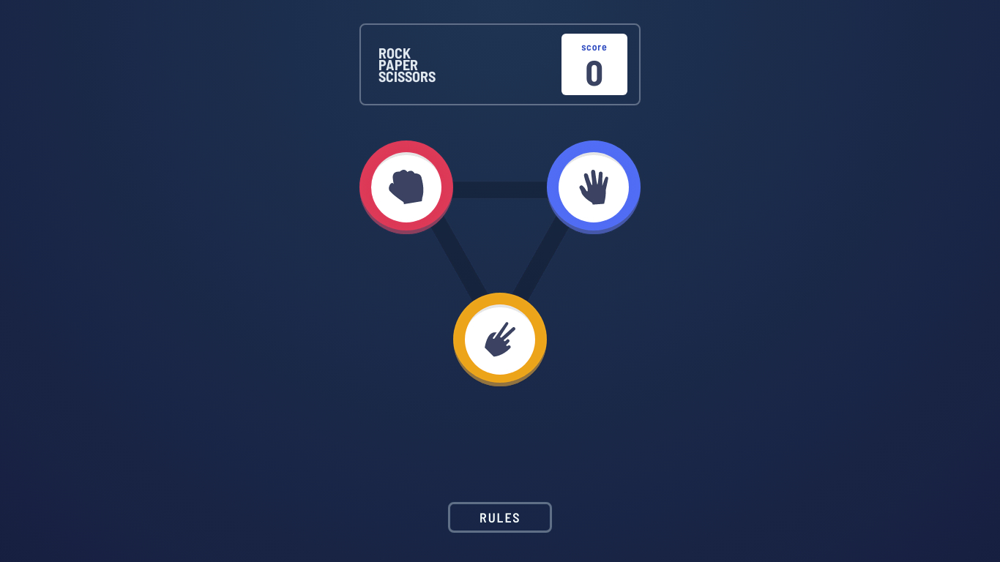

# Frontend Mentor - Rock, Paper, Scissors solution

This is a solution to the [Rock, Paper, Scissors challenge on Frontend Mentor](https://www.frontendmentor.io/challenges/rock-paper-scissors-game-pTgwgvgH). Frontend Mentor challenges help you improve your coding skills by building realistic projects.

## Table of contents

- [Frontend Mentor - Rock, Paper, Scissors solution](#frontend-mentor---rock-paper-scissors-solution)
  - [Table of contents](#table-of-contents)
  - [Developing](#developing)
  - [Building](#building)
  - [Overview](#overview)
    - [The challenge](#the-challenge)
    - [Screenshot](#screenshot)
    - [Links](#links)
  - [My process](#my-process)
    - [Built with](#built-with)
  - [Author](#author)

**Note: Delete this note and update the table of contents based on what sections you keep.**

## Developing

Once you've created a project and installed dependencies with `npm install` (or `pnpm install` or `yarn`), start a development server:

```bash
npm run dev

# or start the server and open the app in a new browser tab
npm run dev -- --open
```

## Building

To create a production version of your app:

```bash
npm run build
```

You can preview the production build with `npm run preview`.

## Overview

### The challenge

Users should be able to:

- View the optimal layout for the game depending on their device's screen size
- Play Rock, Paper, Scissors against the computer
- Maintain the state of the score after refreshing the browser _(optional)_
- **Bonus**: Play Rock, Paper, Scissors, Lizard, Spock against the computer _(optional)_

### Screenshot



### Links

- Solution URL: [https://github.com/teziovsky/rock-paper-scissors](https://github.com/teziovsky/rock-paper-scissors)
- Live Site URL: [http://rockpaperscissors.jakubsoboczynski.pl/](http://rockpaperscissors.jakubsoboczynski.pl/)

## My process

### Built with

- semantic HTML5 markup
- tailwindcss
- flexbox
- mobile-first workflow
- [SvelteKit](https://kit.svelte.dev/)

## Author

- Website - [Jakub Soboczyński](https://www.jakubsoboczynski.pl/)
- Frontend Mentor - [@teziovsky](https://www.frontendmentor.io/profile/teziovsky)
- Twitter - [@teziovsky](https://twitter.com/teziovsky)
